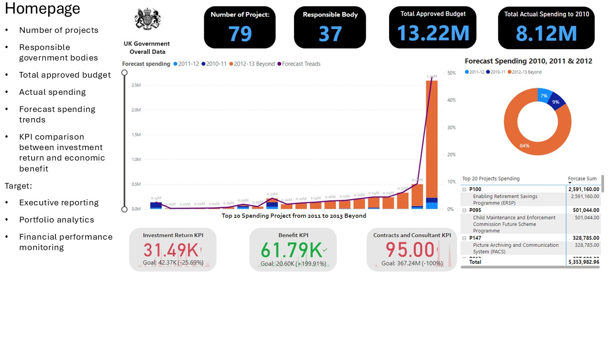
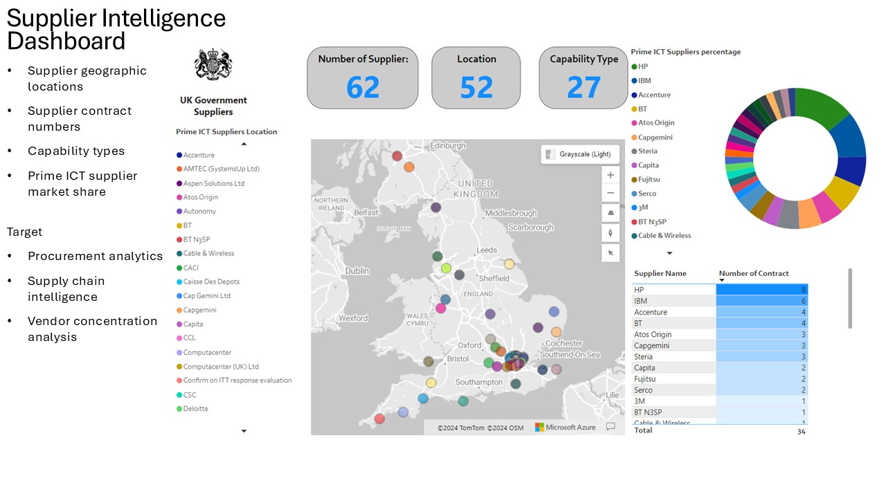
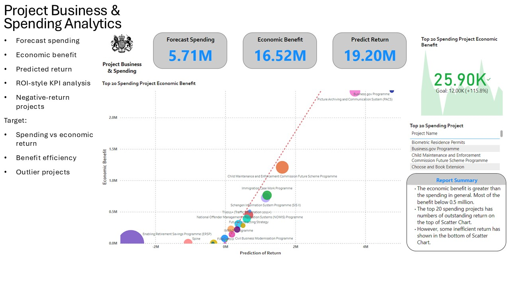
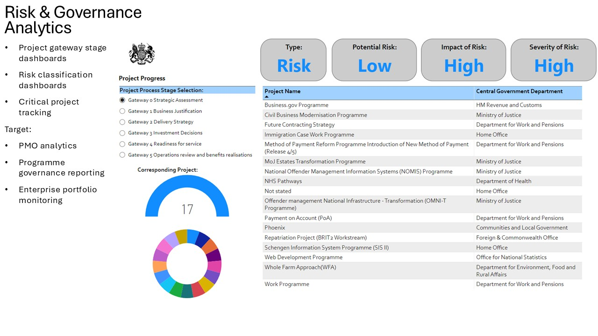
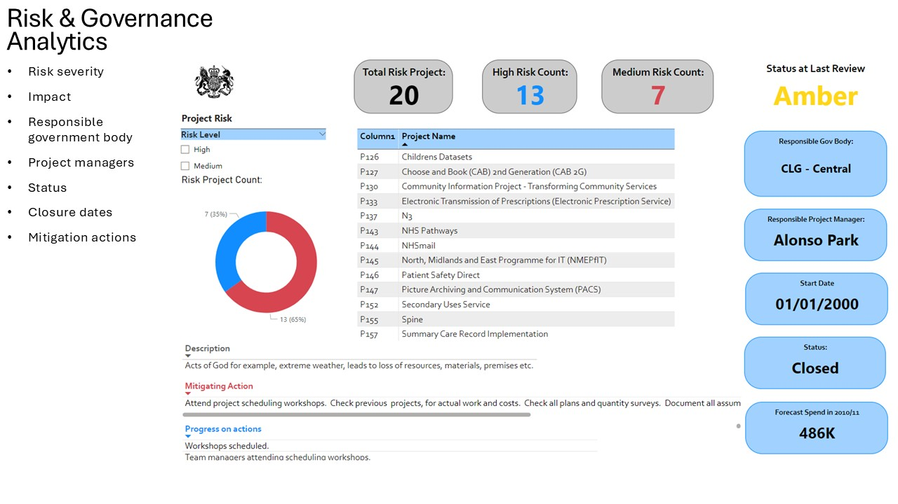
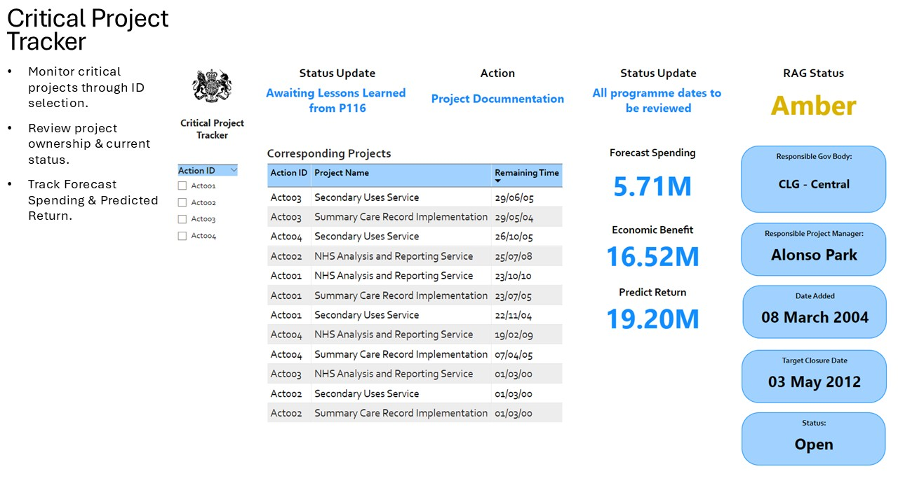

# PowerBI UK Government ICT Project Spending Performance - MSc Data Engineering

This MsC Data Engineering project explores UK Government ICT programme performance through Business Intelligence (BI) and data analytics techniques. The objective was to transform public-sector project datasets into interactive dashboards that support executive reporting, portfolio monitoring, supplier intelligence, spending analysis, risk management, and critical project tracking.

The solution applies data modelling, KPI design, and visual analytics to evaluate project budgets, forecast spending, economic benefits, supplier performance, and governance risks across multiple government departments. The project demonstrates how raw operational data can be transformed into meaningful business insights to support strategic decision-making.

**Skills Demonstrated:**  
Power BI, Data Modelling, KPI Design, Data Visualisation, Business Intelligence, Portfolio Analytics, Risk Analytics, Procurement Intelligence, Dashboard Development

---

### Executive Portfolio Dashboard

The homepage provides an executive-level overview of the UK Government ICT project portfolio, including:

- Number of active projects and responsible government bodies
- Total approved budget and actual spending
- Forecast spending trends from 2010–2013
- Investment return and economic benefit KPIs
- Top spending projects across the portfolio

This dashboard serves as the primary reporting layer for senior stakeholders, enabling portfolio performance monitoring and financial decision-making through a single consolidated view.

---

### Supplier Intelligence Dashboard

This dashboard provides insights into the UK Government ICT supplier ecosystem by analysing supplier distribution, contract activity, capability types, and market concentration. Geographic visualisation enables users to identify supplier locations across the UK, while contract analysis highlights the most active ICT vendors supporting government programmes.

Key metrics include the number of suppliers, operating locations, capability classifications, and supplier contract volumes. The dashboard also presents market share distribution among major ICT suppliers, supporting procurement transparency and vendor performance assessment.

This dashboard supports procurement analytics, supply chain intelligence, and vendor concentration analysis, helping stakeholders understand supplier dependencies and identify opportunities to diversify procurement strategies.

---

### Project Business & Spending Analytics

This dashboard focuses on the financial performance of UK Government ICT programmes by comparing forecast spending, economic benefits, and predicted returns across major projects. The visualisation uses KPI indicators and scatter chart analysis to identify relationships between investment levels and expected business outcomes.

Key metrics include forecast expenditure, economic benefit generation, predicted return on investment, and project-level performance comparisons. The scatter chart helps identify high-performing projects, inefficient investments, and potential outliers requiring further review.

This dashboard supports portfolio investment management, business case evaluation, and benefits realisation analysis. By transforming project spending data into measurable performance indicators, decision-makers can prioritise investments, improve resource allocation, and monitor the effectiveness of government ICT programmes.

---
### Risk & Governance Analytics

This dashboard provides visibility into programme governance, project gateway reviews, and risk management across UK Government ICT initiatives. It enables stakeholders to monitor project progression through gateway stages while identifying programmes that require additional oversight or intervention.

Key metrics include risk type, impact level, severity classification, and the number of projects associated with each governance stage. Interactive filtering allows users to review project portfolios by gateway status, responsible government department, and risk category.

The dashboard supports PMO reporting, enterprise portfolio governance, and risk monitoring by highlighting potential delivery concerns and governance bottlenecks. By consolidating project and risk information into a single view, decision-makers can improve accountability, prioritise mitigation actions, and strengthen programme assurance processes.

---
### Risk Detail & Mitigation Analytics

This dashboard provides a detailed view of project risks by enabling users to explore risk severity, impact levels, ownership, mitigation actions, and project status. Interactive filtering allows stakeholders to focus on high- and medium-risk projects while reviewing associated government departments, project managers, and forecast spending.

The dashboard combines quantitative risk metrics with qualitative information such as risk descriptions, mitigation plans, and progress updates. This supports risk assessment, issue management, and governance reviews by providing a structured view of project-level concerns and corrective actions.

---
### Critical Project Tracker

This dashboard is designed to monitor critical projects requiring management attention. It consolidates project status updates, action tracking, forecast spending, economic benefits, predicted returns, and RAG (Red-Amber-Green) indicators into a single operational view.

Users can review project ownership, responsible government bodies, key milestones, target closure dates, and outstanding actions. The dashboard supports programme management and executive decision-making by highlighting projects with delivery concerns, unresolved issues, or significant business impact.

By combining financial performance metrics with project status reporting, the dashboard enables proactive intervention and improved oversight of high-priority government ICT programmes.

---